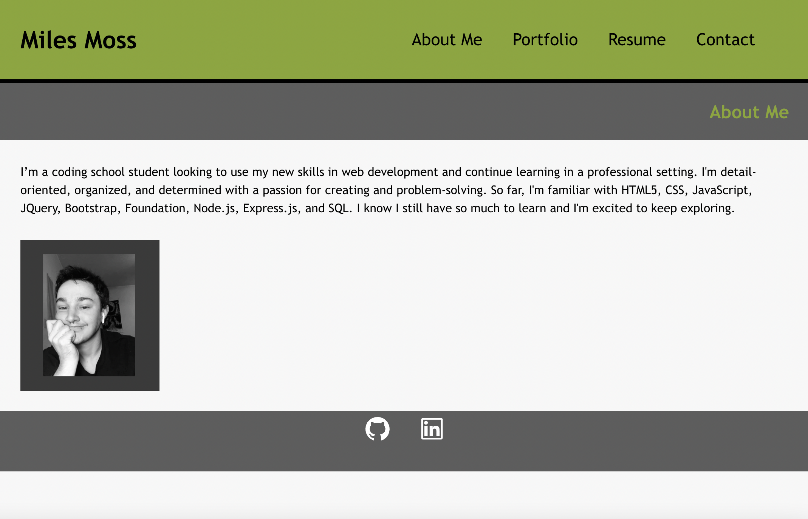
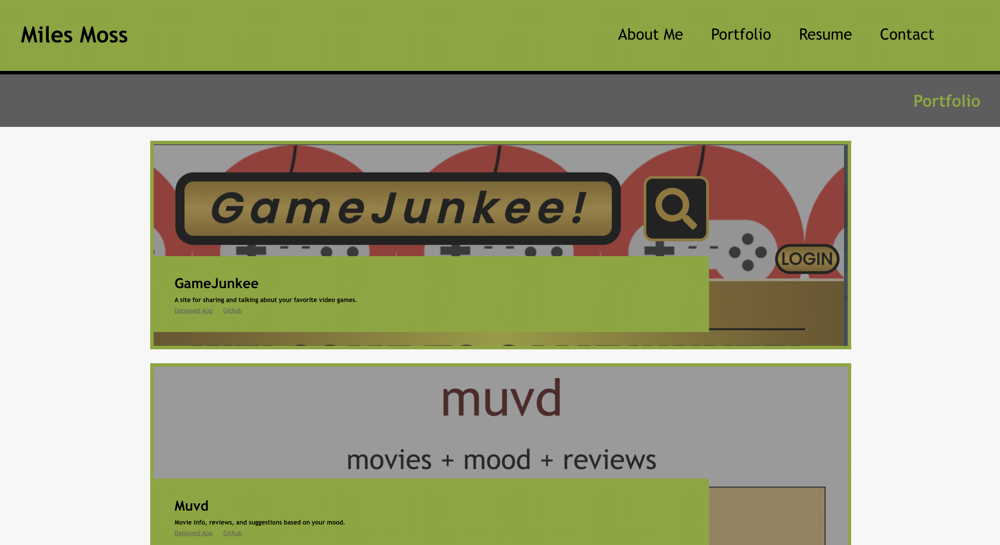
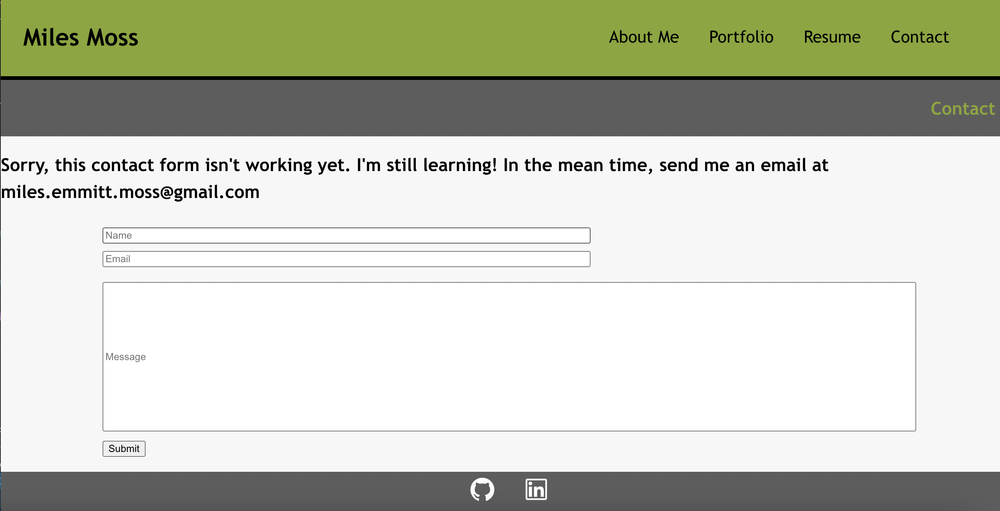
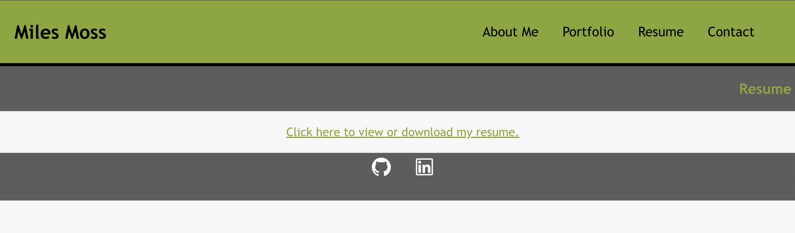

# react-portfolio

      
      #React Portfolio
      

      ## Table of Contents:
      * [Description](##Description) 
      * [Installation](##Installation)
      * [Usage](##Usage)
      * [Contributing](##Contributing)
      * [Testing](##Testing)
      * [License](##License)
      * [Questions](##Questions)

      ## Description:
      This is a coding portfolio made using React and AntDesign.  It has an "About Me" page, a portfolio of some of my coding projects, a link to download a copy of my resume, and a contact page. The contact page isnt fully functional... yet.

      This project is not deployed.  Even with help from the professor and TAs, I have no idea why I cant get it deployed to GitHub Pages or Heroku.  I've tried everything I can think of, includign starting a new repo several times. Sorry.

    
    
    
    
    

      ## Installation:
      No installation needed.
      
      ## Usage:
      Just take a look.

      ## Contributing:
      Contact me on Github or through email with any ideas on how I can improve my portfolio. 

      
      ## Testing:
      No tests necessary.

      ## License:
      
      This project is under the MIT license: (https://opensource.org/licenses/MIT)

      
      ## Questions:
      Contact me here with any questions about this project:
      Github: monstermiles
      Email: miles.emmitt.moss@gmail.com